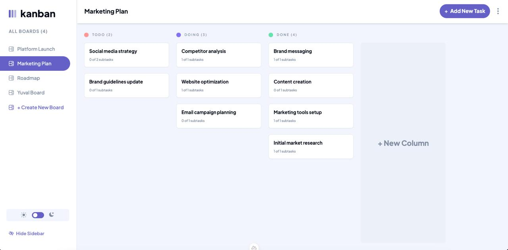
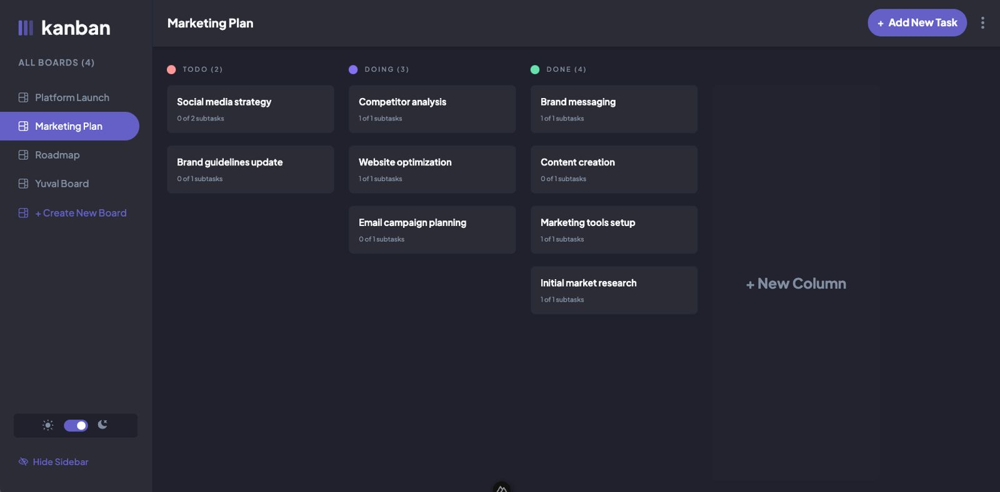
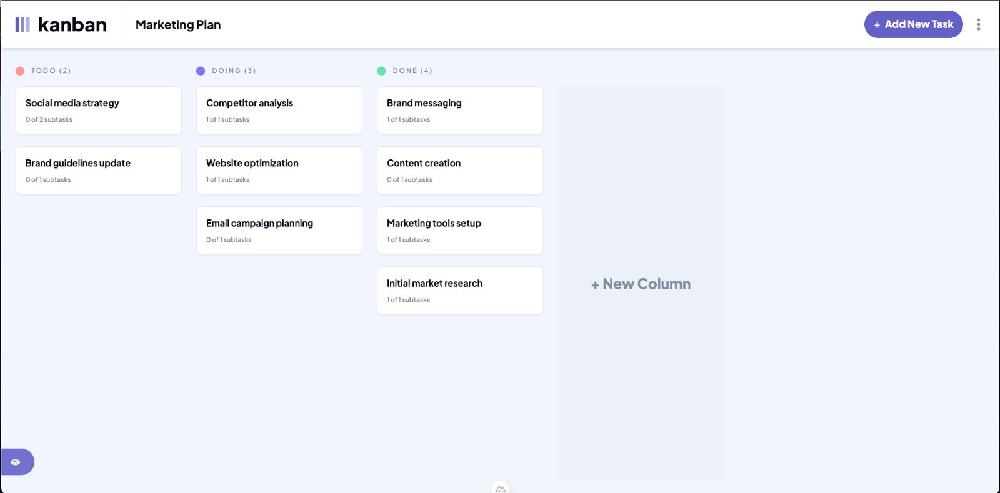

<div align="center">
  <h1>📋 Kanban Task Management</h1>
  <p>A modern task management application built with Vue 3 and Nuxt</p>
</div>

## 📸 Screenshots

<div align="center">
  
  
  
  
</div>

## ✨ Features

- 📱 Responsive design for mobile and desktop
- 🌓 Light/Dark mode toggle
- 🔄 Drag and drop tasks between columns
- 💾 Local storage persistence
- ✨ Modern and clean UI
- ♿ Accessibility features

## 🛠️ Tech Stack

### Core

- **Vue.js 3** - Progressive JavaScript Framework
- **Nuxt 3** - Vue.js Framework
- **TypeScript** - Type Safety

### State Management

- **Pinia** - State Management
- **Pinia Persist** - State Persistence

### Styling

- **Tailwind CSS** - Utility-first CSS
- **SCSS** - CSS Preprocessor
- **ShadcnUI** - UI Components

### Components

- **Radix Vue** - Headless UI Components
- **Vue Draggable Next** - Drag & Drop
- **Lucide Icons** - Icon Pack

## 🚀 Getting Started

1. **Clone the repository**

```bash
git clone [your-repo-url]
cd kanban-task-management


Install dependencies

bashCopypnpm install

Run development server

bashCopypnpm dev

Build for production

bashCopypnpm build
📁 Project Structure
Copy├── assets/           # Static assets & global styles
│   ├── css/         # SCSS files
│   └── images/      # Image assets
├── components/      # Vue components
│   ├── ui/         # Shadcn components
│   └── icons/      # Icon components
├── composables/     # Vue composables
├── layouts/        # Layout components
├── pages/          # Page components
├── public/         # Public static files
├── stores/         # Pinia stores
└── types/          # TypeScript types
💡 Key Features
Board Management

Create, edit, and delete boards
Customize board layouts
Real-time updates

Task Management

Create and edit tasks
Add subtasks
Track progress
Drag and drop reordering

UI/UX

Responsive design
Dark/Light themes
Smooth animations
Intuitive interface

Data Handling

Local storage persistence
State management with Pinia
Type-safe with TypeScript
```
